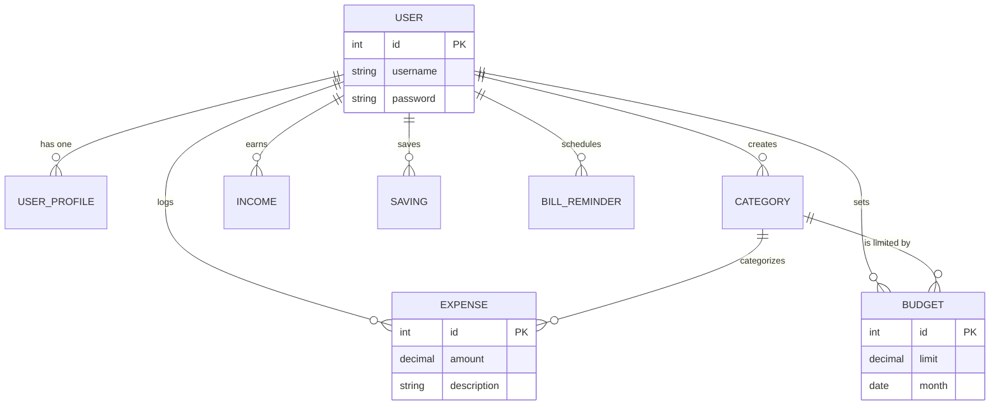
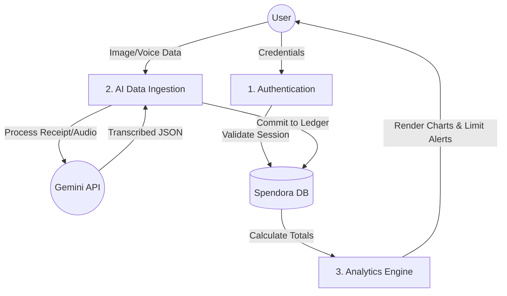
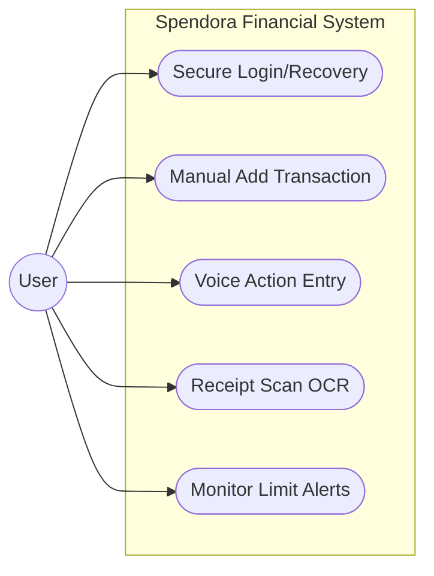
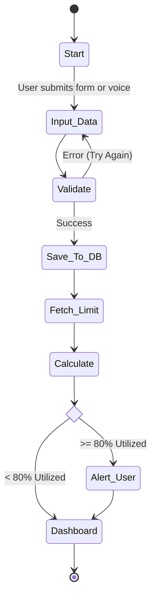
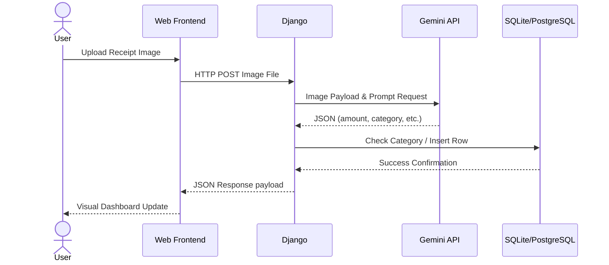
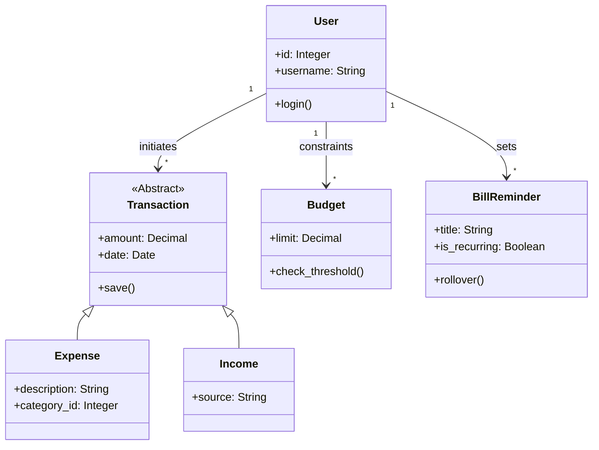
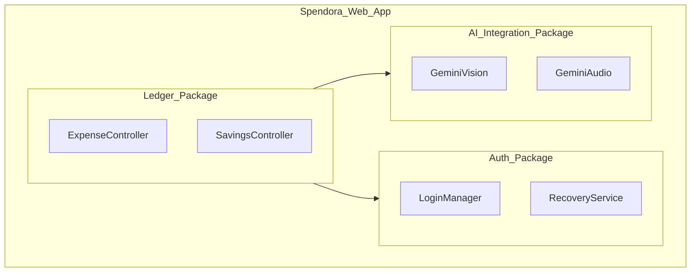
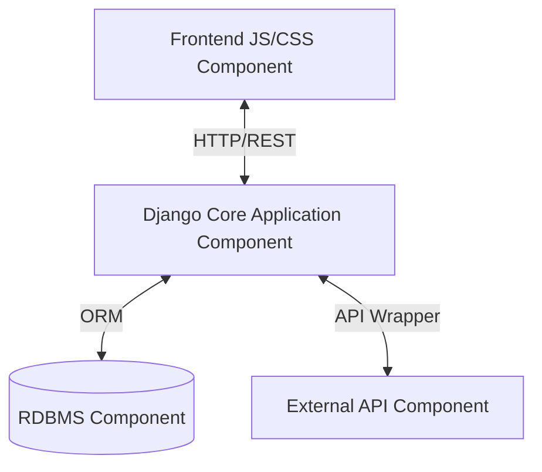
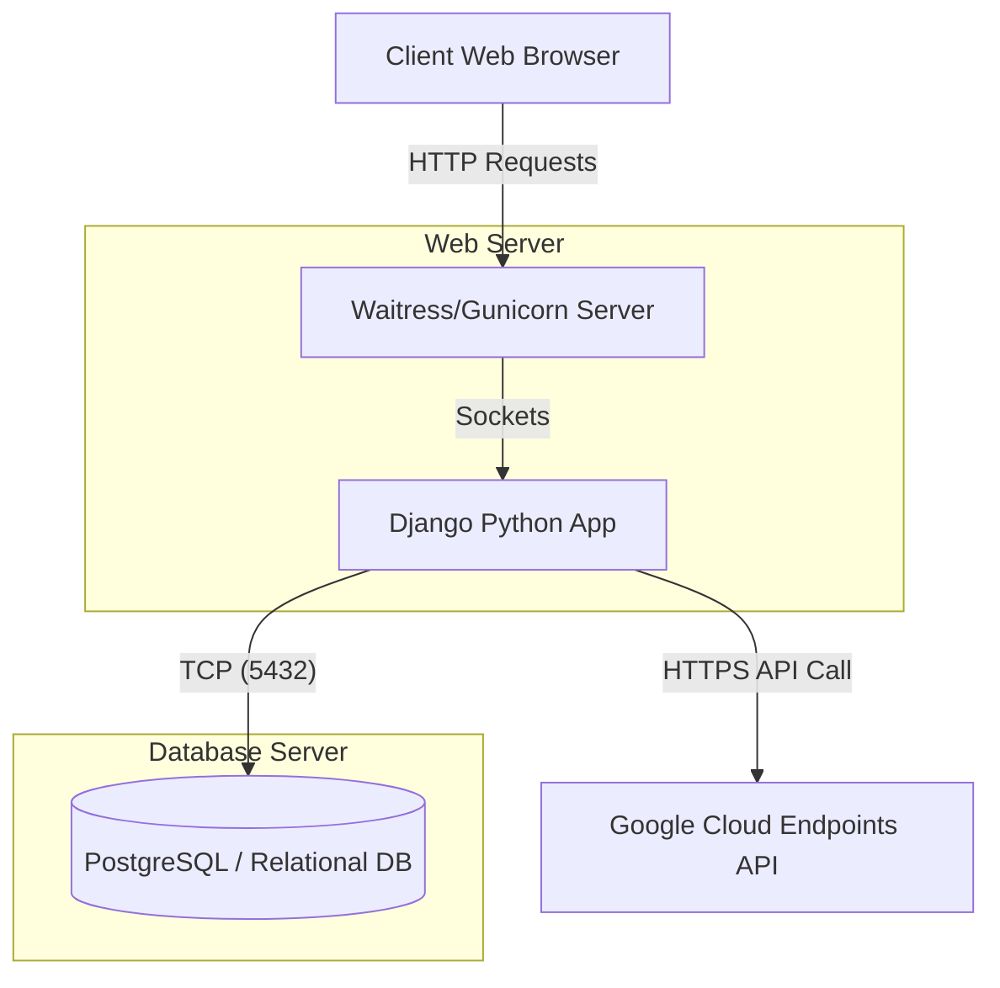

# Spendora Project Report

## 1. INTRODUCTION

### 1.1 Existing System
* **Manual Entry Bottleneck:** Existing systems often rely heavily on manual data entry, such as typing into spreadsheets or writing in ledgers, leading to high error rates and time consumption.
* **Fragmented Tools:** Users frequently have to use separate applications for tracking expenses, managing savings, and setting budgets, resulting in a disjointed financial view.
* **Lack of Intelligent Parsing:** Traditional systems require users to manually type out receipts rather than utilizing optical character recognition (OCR) or artificial intelligence to extract data automatically.
* **Reactive Budgeting:** Most tools only show where money went after it was spent, failing to provide proactive alerts before budgets are exceeded.

### 1.2 Need for System
* **Streamlined Workflow:** A unified system is needed to bring expenses, income, savings, and bills into a single, cohesive dashboard.
* **Automation:** To reduce manual effort, there is a strong need for integrated AI to parse receipts visually and handle voice-command logging.
* **Proactive Protection:** The system needs real-time threshold warnings (e.g., alerting when 80% of a budget is reached) to enforce financial discipline.
* **Rollover Automation:** A platform is required to automatically manage and track recurring monthly bills without requiring user intervention every 30 days.

### 1.3 Scope of Project
* **Personal Finance Focus:** The system is built to handle the rigorous everyday financial tracking needs of individual users.
* **AI Integration:** Implements state-of-the-art Large Language Models (Gemini Flash API) to convert unstructured data (receipts/voice) into structured spending data.
* **Secure Architecture:** Built with robust local authentication mechanisms, password recovery using security questions, and strong CSRF protections.
* **Holistic Dashboarding:** Provides dynamic graphical analytics depicting historical trends and future spending predictions based on recorded behavior.

### 1.4 Operating Environment
**Hardware Requirements**
* **Processor:** Multicore x86_64 or ARM processor.
* **Memory:** Minimum 4GB RAM to ensure smooth local server deployment and AI API routing.
* **Peripherals:** Microphone (for voice commands) and Camera/Scanner (for receipt processing).
* **Network:** Active broadband internet connection required to access remote Gemini AI endpoints.

**Software Requirements**
* **Frontend Technologies:** HTML5, CSS3, Vanilla JavaScript (Custom responsive styling/Glassmorphism).
* **Backend Technology:** Python 3.x with the Django Web Framework.
* **Database:** SQLite3 for development/local execution, scaling to PostgreSQL for production.
* **Web Server:** Gunicorn or Waitress serving as the WSGI HTTP Server.

---

## 2. PROPOSED SYSTEM

### 2.1 Objectives of the System
* **Unify Financial Data:** To consolidate varying financial inputs—income, expenses, and savings—into one highly responsive platform.
* **Leverage Artificial Intelligence:** To deploy Gemini AI endpoints to accurately classify, parse, and log receipt imagery and audio commands effortlessly.
* **Ensure Proactive Budgeting:** To establish robust logic that constantly calculates budget utilization dynamically and flags over-budget scenarios preemptively.
* **Guarantee Aesthetic Superiority:** To deliver a warm, premium, and highly interactive user UI/UX avoiding generic libraries in favor of tailored modern CSS.

### 2.2 User Requirement
* **Secure Access:** Users require secure registration, login handling, and an isolated self-recovery tool utilizing security Q/A mechanisms.
* **Diverse Input Methods:** Users must be able to input data through standard forms, voice dictation, and receipt image uploads.
* **Visual Clarity:** Users depend on clear pie charts, bar graphs, and metric cards to understand their cash flow instantly upon login.
* **Reliable Notifications:** Users require the system to accurately highlight upcoming or missed recurring bills automatically.

---

## 3. ANALYSIS AND DESIGN

### 3.1. ER Diagram
*The database structure capturing the distinct relationships holding user data together.*

### 3.1.1 DFD
*Level 1 Data Flow representation mapping the ingestion and alerting logic through Spendora components.*

### 3.2. Use Case Diagram
*Identifying exactly what actors can do within the platform.*

### 3.3. Activity Diagram
*The logical flow path executed when a user attempts to add an expense with limit checking.*

### 3.4. Sequence Diagram
*Step-by-step communication over time specifically regarding AI receipt parsing.*

### 3.5. Class diagram
*Object-oriented structuring of the Backend Model layer.*

### 3.6 Package Diagram
*High-level modular groupings inside the Django project architecture.*

### 3.7 Component Diagram
*Identifying the modular components involved in rendering the deployment cycle.*

### 3.8 Deployment Diagram
*The hardware framework executing the project execution flow.*

### 3.9 UML
* **Extensive Usage:** Unified Modeling Language (UML) has been heavily adopted to map out varying project perspectives dynamically throughout Spendora.
* **Structural Blueprint:** Class and Package diagrams rigorously defined Django’s backend MVT configuration and ORM structures before coding began.
* **Behavioral Guidance:** Activity and Sequence diagrams mapped out complex flows like limit threshold loops and asynchronous Gemini AI calls.
* **Communication:** Standardized DFDs and ERDs ensure stakeholders, analysts, and developers share an identical and uncompromised vision over data paths and table schemas.

---

## 5. DRAWBACKS AND LIMITATIONS
* **Dependency on Internet:** The most powerful AI features, including receipt parsing and voice translation, require constant internet access to connect with the integrated Gemini APIs.
* **Manual Banking Updates:** Direct automatic integrations with bank PLAID APIs or secure OAuth feeds are not yet established natively, requiring manual updates or manual image uploads.
* **Voice Variability:** Heavy background noise or extreme audio nuances currently create a slight probability of voice-command misunderstanding, necessitating occasional user correction post-translation.

## 6. CONCLUSION
* Spendora successfully addresses the chaotic nature of modern personal finance by blending rigid, traditional spreadsheet-tracking logic with responsive, modern aesthetic UI principles.
* By introducing automated AI capabilities to parse unstructured data like spoken words and physical receipt images, it practically eliminates the friction usually associated with personal accounting. 
* Ultimately, the implementation of dynamic, proactive limit alerts and isolated savings flows successfully fulfills the primary goal: establishing a functional environment that encourages fiscal responsibility and wealth generation automatically.

## 7. BIBLIOGRAPHY
* **Django Software Foundation:** Official Django Documentation (https://docs.djangoproject.com/)
* **Google Cloud:** Gemini Pro / Flash API Documentation (https://ai.google.dev/)
* **Python Software Foundation:** Python 3 Language Reference
* **Mermaid:** Markdown visual charting syntax guides (https://mermaid.js.org/)
