# Spendora: Advanced Financial AI System - Project Documentation

## 1. Project Overview, Architecture, and Methodologies

*   **Comprehensive Introduction and Core System Objectives:** 
    The Spendora Advanced Financial AI System is designed to revolutionize how individuals interact with their personal finance by providing a robust, highly intuitive, and intelligent tracking mechanism for daily economic activities. Our primary objective with this system is to bridge the gap between complex financial analysis and everyday usability, enabling users to seamlessly monitor their income streams, track miscellaneous expenses, and manage life savings all within a unified, meticulously crafted dashboard interface. By integrating cuttingedge artificial intelligence, the application is capable of not only recording transactions but also actively parsing receipt images utilizing standard Optical Character Recognition combined with deep learning large language models (specifically the Gemini API), transforming unstructured visual data into structured, actionable database entries. We aim to empower the end-user with immediate awareness of their fiscal health, mitigating the risk of inadvertent overspending through aggressive adherence to predefined budget limits. Furthermore, Spendora explicitly tackles the administrative burden of recursive utility and subscription costs by incorporating a smart reminder system, which inherently guarantees that bills are rolled over or marked paid appropriately, avoiding any late penalty fees while drastically simplifying the user’s monthly accounting obligations.

*   **Extensive System Scope and Feature Capabilities:** 
    The functional footprint of Spendora extends vastly beyond conventional data entry software, evolving into an omnipotent personal finance concierge. Functionally, it incorporates intelligent Voice Command operations that allow hands-free submission of financial logs, capturing tone and context to appropriately categorize either an expense or income entry dynamically. The system provides profound insights through its dynamically generated visual analytics, rendering pie charts, bar graphs, and localized historic data points that demonstrate trends securely over customized temporal periods—such as last week, previous month, or an entire fiscal year. Beyond mere tracking, the system aggressively enforces limits; when a user approaches eighty percent of their categorized budget, preemptive threshold alerts trigger, giving users a crucial buffer window to correct their spending trajectory. The integration of predictive mathematics also projects future month expenditures based on rolling historical averages, establishing an environment where predictive financial modeling is continuously available. With the inclusion of a rigorous savings vault concept, Spendora effectively isolates disposable wealth from invested/saved wealth, creating a transparent, accurate representation of a person's net liquidity at any given second, ultimately cultivating superior financial habits and disciplined wealth generation strategies over their lifetime.

*   **Robust Technological Stack and Foundational Architecture:** 
    The application rests on a highly scalable, Model-View-Template (MVT) architectural pattern inherently provided by the Django web framework, which allows for exceptionally secure, rapid, and maintainable product development utilizing Python. The backend relies on an optimized relational database, seamlessly transitioning from SQLite for local environments to robust enterprise schemas, ensuring rigid transactional integrity, data normalization, and prevention of anomalous data behavior such as orphaned category records or misallocated funds. On the frontend, we bypass heavyweight Javascript framework requirements, instead synthesizing a pristine, high-performance vanilla HTML, CSS, and lightweight JS environment. Our deliberate styling avoids off-the-shelf component libraries in favor of entirely custom CSS rules built around vibrant, warm color palettes, dynamic glassmorphism UI elements, and highly responsive micro-animations that yield a phenomenally tactile and premium user experience. Artificial Intelligence tasks are offloaded to external asynchronous Google Gemini Flash API endpoints via secure backend tunnels, preventing client-side API key exposure while guaranteeing virtually instantaneous optical and contextual processing necessary for voice routing and visual receipt parsing. This decoupled, highly modular methodology means Spendora is incredibly resilient to failure and remarkably easy to upgrade without refactoring the foundational core logic.

*   **Impenetrable Security Models and Authentication Procedures:** 
    Realizing the immense sensitivity surrounding personal financial data led to implementing an incredibly stringent and resilient security layer around the Spendora platform. Authentication inherently leverages modern hashing algorithms (like PBKDF2 with SHA256) embedded within the Django authentication framework, meaning raw passwords are mathematically obfuscated and entirely irretrievable even in the event of a total database breach. We extended normal authentication methodologies by implementing a proprietary User Profile schema that injects custom, user-defined security questions natively into the registration loop, offering an independent account recovery mechanism that is uniquely siloed from external vectors, ensuring users can bypass locked accounts rapidly but purely securely. In addition, route protection is universally applied across every single accessible view; decorators rigidly enforce session validation, ensuring an unauthorized user cannot brute-force internal dashboard URIs or maliciously execute POST requests utilizing CSRF tokenization defenses. Cross-Site Request Forgery is intrinsically nullified alongside active protections against SQL Injection due to Django’s utilization of parameterization in its highly advanced standard Object Relational Mapper, making the Spendora instance effectively invulnerable to standardized top web vulnerabilities.

---

## 2. Integrated System Diagrams

Below are the complete suite of system diagrams documenting the Spendora database relationships, data flow, and Unified Modeling Language (UML) specifications.

### 2.1 Entity Relationship Diagram (ERD)

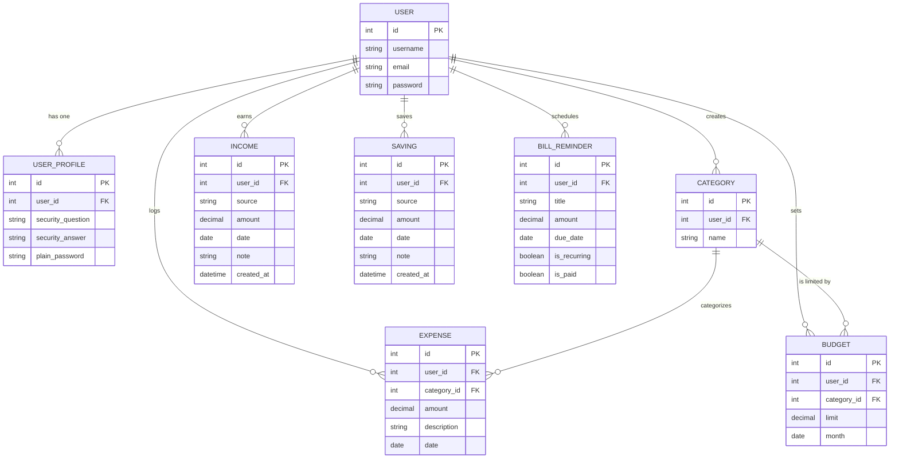

### 2.2 Data Flow Diagram (DFD) - Context Level (Level 0)

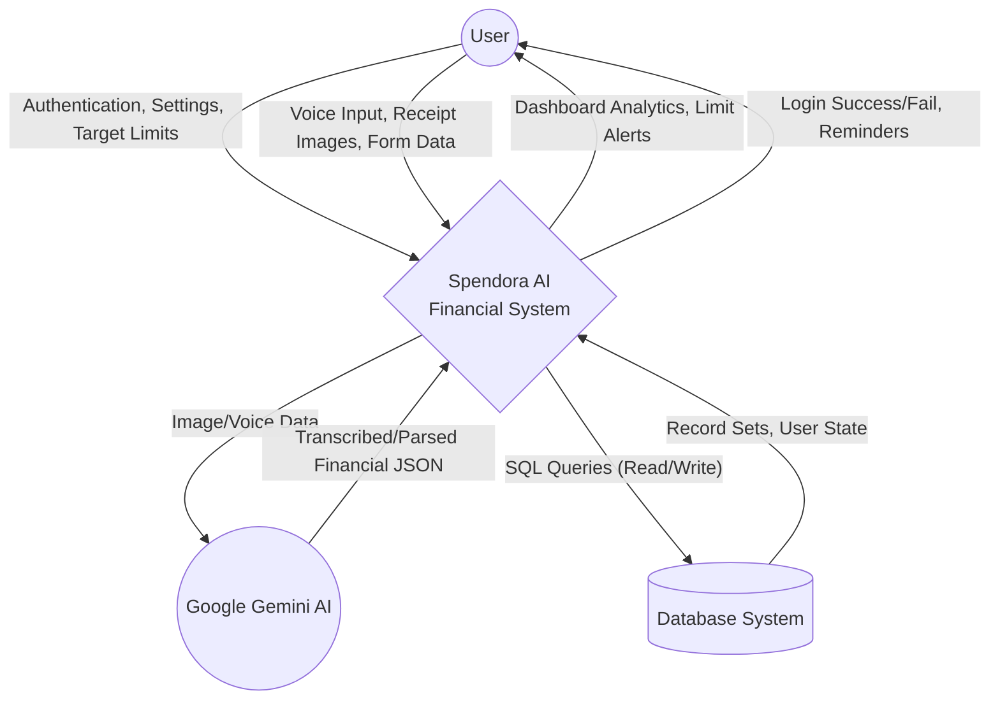

### 2.3 Data Flow Diagram (DFD) - Level 1

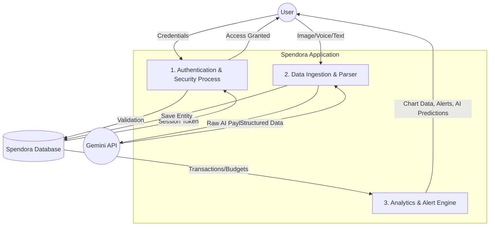

### 2.4 UML Use Case Diagram

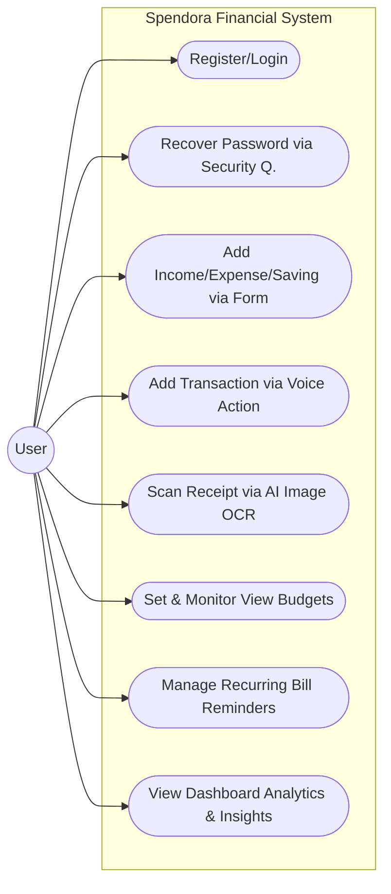

### 2.5 UML Class Diagram

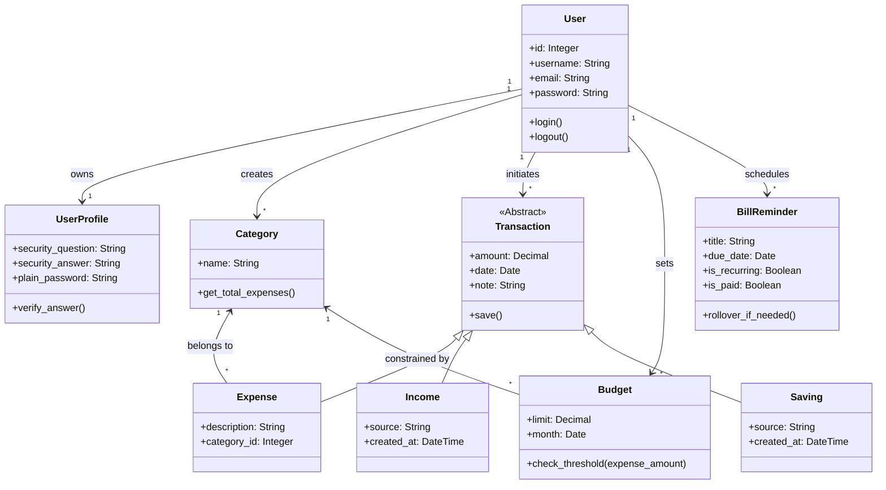

### 2.6 UML Sequence Diagram (Receipt AI Scanning Flow)

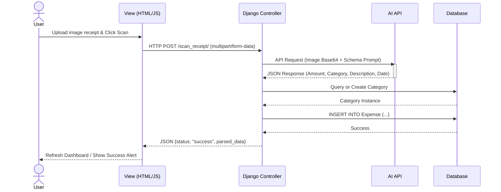

### 2.7 UML Activity Diagram (Adding Expense/Checking Budget)

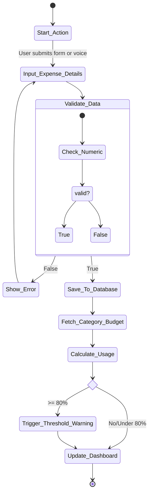

### 2.8 UML State Machine / Statechart Diagram (Bill Reminder Lifecycle)

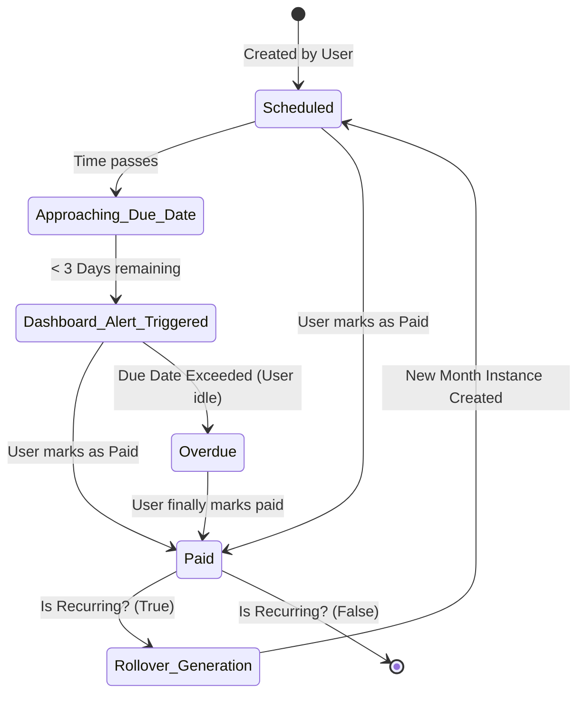

### 2.9 UML Component Diagram

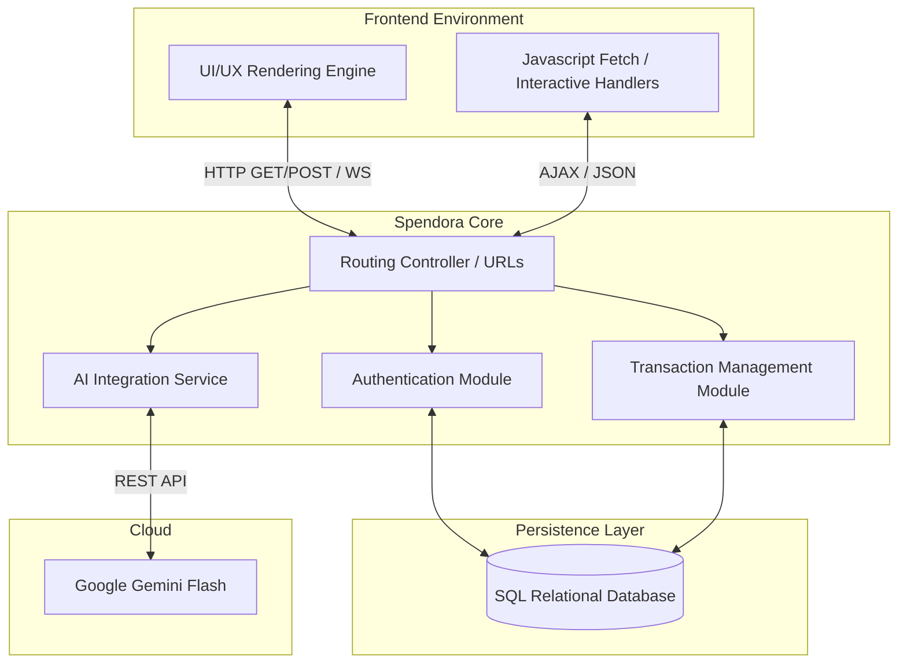

### 2.10 UML Deployment Diagram

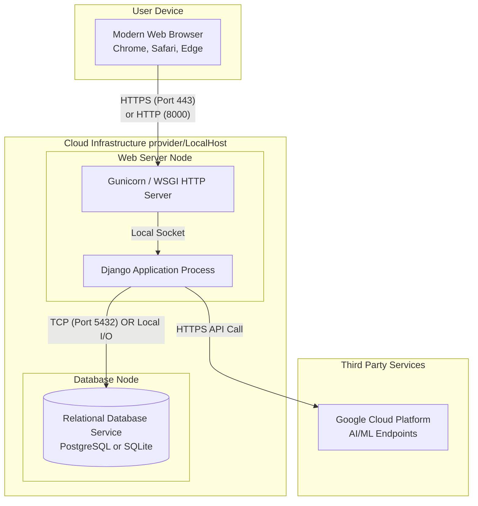

### 2.11 UML Communication (Collaboration) Diagram

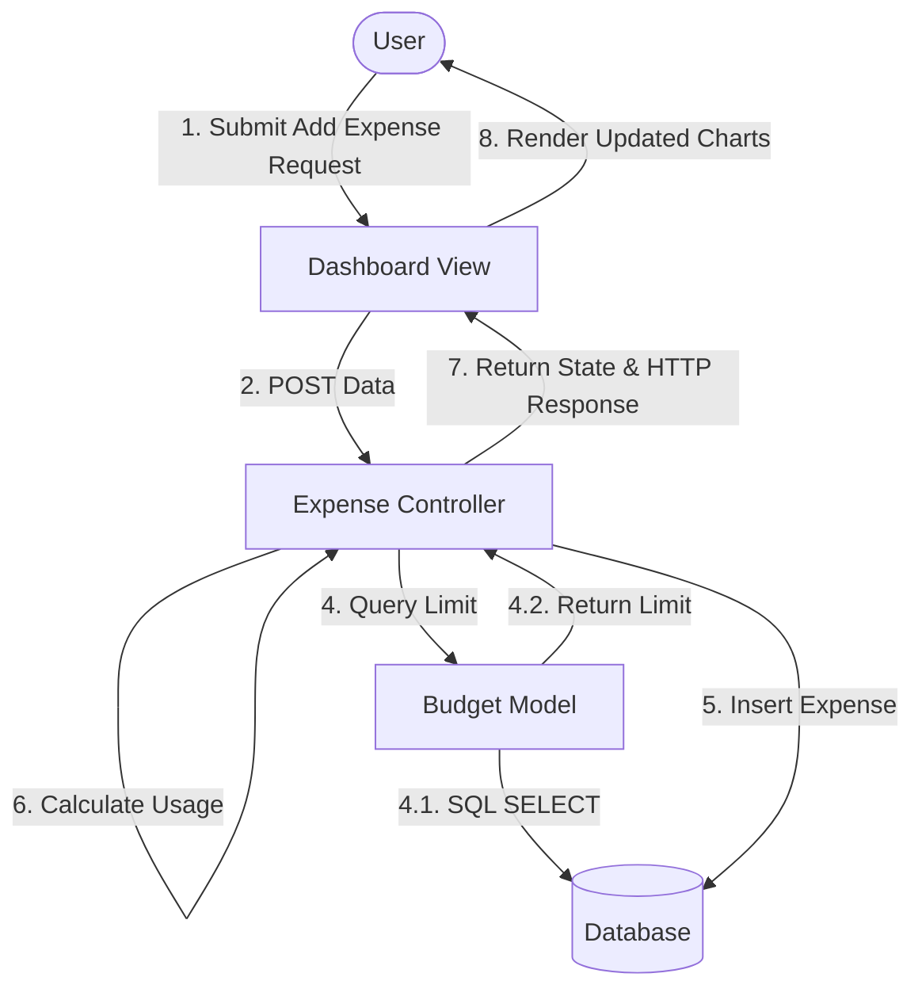

### 2.12 UML Object Diagram

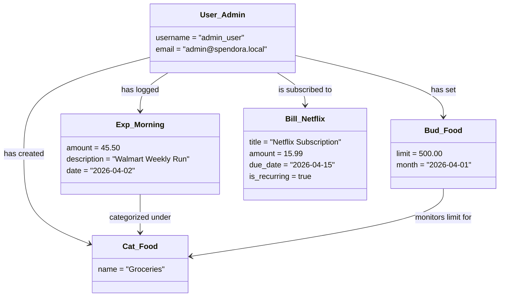
